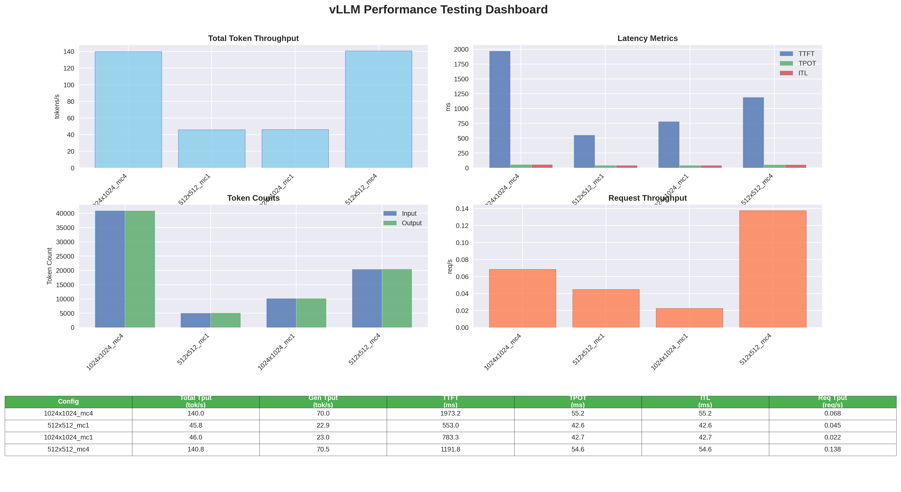
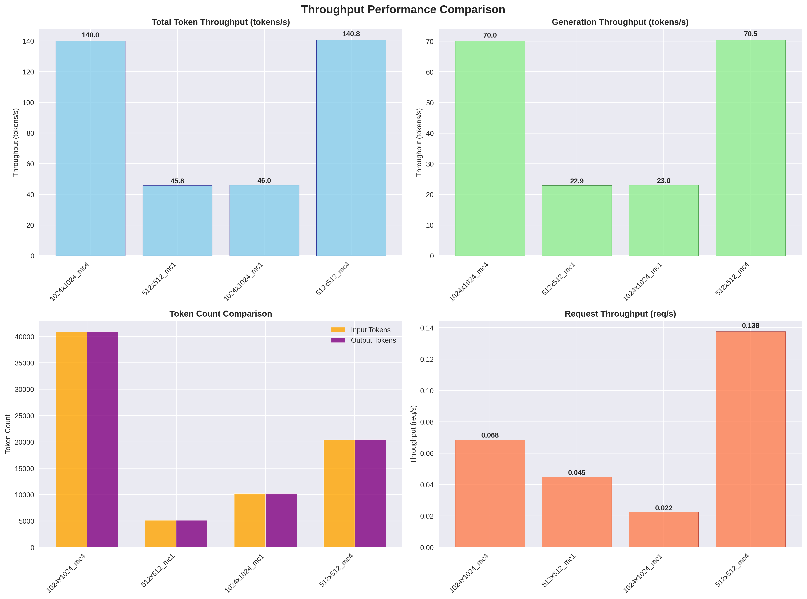
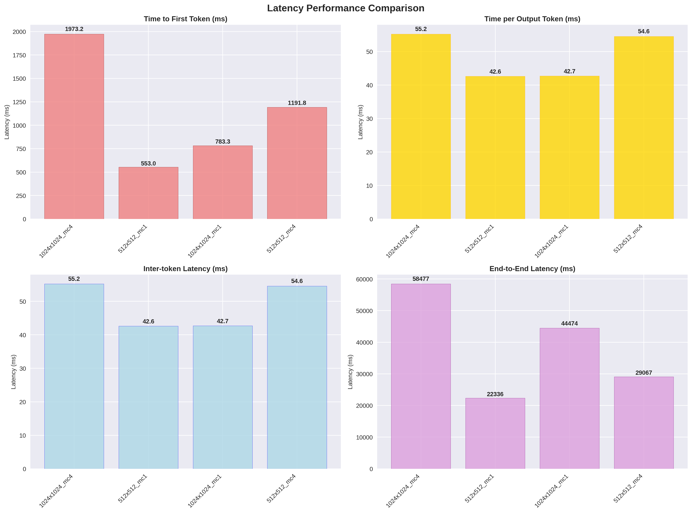
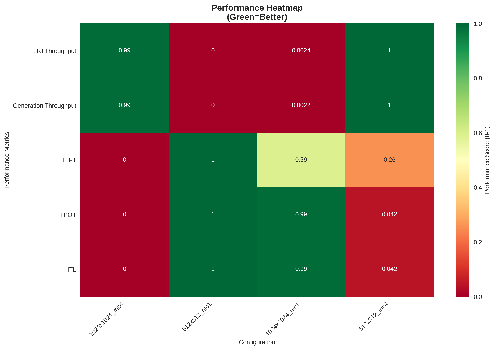

# vLLM推理服务压测工具

这是一个基于[vLLM](https://github.com/vllm-project/vllm)推理引擎的性能压测框架。该工具基于vLLM官方的[benchmarks](https://github.com/vllm-project/vllm/tree/main/benchmarks)目录提供的压测工具进行开发。

- **智能结果管理**: 自动按模型名称和测试时间组织结果目录
- **灵活聚合选择**: 支持选择特定测试结果进行聚合分析
- **统一入口脚本**: 集成批量测试、单次测试和结果聚合功能

## 📌 功能特点

本工具用于评估vLLM在线推理服务的关键性能指标，包括：

* **延迟 (Latency)** - 请求响应时间
* **吞吐量 (Throughput)** - 每秒处理的请求数和token数
* **首token时间 (TTFT)** - 从发送请求到收到第一个token的时间
* **token间延迟 (ITL)** - 相邻token之间的生成间隔
* **每token输出时间 (TPOT)** - 平均每个输出token的生成时间
* **端到端延迟 (E2EL)** - 完整请求的总处理时间

该压测工具假设vLLM服务器运行在**OpenAI兼容**模式下。服务器设置说明请参考[vLLM快速开始指南](https://docs.vllm.ai/en/latest/getting_started/quickstart.html)。

## 🚀 快速开始

### 三步快速体验

```bash
# 1. 批量压测（结果自动保存到 results/模型名_时间戳/ 目录）
python main.py batch

# 2. 聚合最新的测试结果
python main.py aggregate

# 3. 生成可视化报告
python main.py visualize
```


### 🎯 可视化功能

工具提供统一的可视化命令，支持多种模式：

#### 统一可视化命令 ⭐（推荐）
```bash
# 自动查找最新的聚合结果，生成完整版报告
python main.py visualize

# 生成简化版报告（基础图表，无外部依赖）
python main.py visualize --mode simple

# 生成两种模式的报告
python main.py visualize --mode both --output all_charts

# 指定特定的CSV文件
python main.py visualize --csv results/DeepSeek-R1_20250728_152452/aggregate_results_20250728.csv
```

**可视化模式说明**：

1. **simple模式**（基础图表）
   - 吞吐量对比图、延迟对比图、性能热力图
   - 自动处理中文字体问题
   - 无需额外依赖包

2. **advanced模式**（完整报告，默认）
   - 包含simple模式的所有图表
   - 额外提供综合仪表板
   - 详细的性能报告文本文件

3. **both模式**（两种模式）
   - 同时生成simple和advanced两种报告
   - 分别保存在子目录中

> **💡 提示**：推荐使用统一的`python main.py visualize`命令，支持自动查找最新CSV文件和多种报告模式。

#### 关键指标说明

| 指标 | 英文名称 | 说明 | 单位 |
|------|----------|------|------|
| 输入令牌 | prompt_tokens | 输入的token数量 | tokens |
| 输出令牌 | completion_tokens | 生成的token数量 | tokens |
| 总吞吐量 | TOTAL_THROUGHPUT | 总token处理速度 | tokens/s |
| 生成吞吐量 | generate_throughput | 输出token生成速度 | tokens/s |
| 首令牌时间 | TTFT | 从请求到首个token的时间 | ms |
| 每令牌时间 | TPOT | 平均每个输出token的时间 | ms |
| 令牌间延迟 | ITL | 相邻token间的延迟 | ms |

---

## 🔧 环境设置

使用以下命令安装所需的Python包：

```bash
pip install -r requirements.txt
```

### 依赖包说明

- `vllm` - vLLM推理引擎（用于分词器）
- `transformers` - HuggingFace变换器库
- `aiohttp` - 异步HTTP客户端
- `pandas` - 数据处理和分析
- `datasets` - HuggingFace数据集库

---

## ⚙️ 配置说明

编辑`config.yaml`文件来配置压测参数：

```yaml
# 模型和服务器配置
model: "deepseek-ai/DeepSeek-R1-Distill-Qwen-32B"        # 要压测的模型名称
base_url: "http://localhost:8010"                        # vLLM服务器URL
tokenizer: "deepseek-ai/DeepSeek-R1-Distill-Qwen-32B"   # 分词器路径

# 输入输出token长度组合
input_output:
  - [256, 256]    # [输入长度, 输出长度]
  - [512, 512]
  - [1024, 1024]

# 并发数和请求数组合  
concurrency_prompts:
  - [1, 10]       # [最大并发数, 总请求数]
  - [4, 40]
  - [8, 80]
  - [16, 160]
```

### 配置参数详解

- `model`: 在vLLM服务器中配置的模型名称
- `base_url`: vLLM服务器的基础URL地址
- `tokenizer`: 包含分词器文件的路径
- `input_output`: 输入和输出token长度的组合列表
- `concurrency_prompts`: 最大并发数和总请求数的组合列表

工具会对所有参数组合进行笛卡尔积测试，即每个输入输出长度组合都会在每个并发配置下进行测试。

---

## 🚀 运行压测

### 1. 启动vLLM服务器

首先确保vLLM服务器正在运行：

```bash
vllm serve deepseek-ai/DeepSeek-R1-Distill-Qwen-32B \
    --host 0.0.0.0 \
    --port 8010 \
    --swap-space 16
```

### 2. 使用统一入口脚本（推荐）⭐

#### 批量压测
根据`config.yaml`中的配置开始压测（自动创建按模型和时间命名的目录）：
```bash
python main.py batch
```

#### 单次压测
执行单次压测（自动创建按模型和时间命名的目录）：
```bash
python main.py single \
    --model deepseek-ai/DeepSeek-R1-Distill-Qwen-32B \
    --base-url http://localhost:8010 \
    --num-prompts 100 \
    --max-concurrency 10
```

#### 聚合结果
```bash
# 查看可用的结果目录
python main.py aggregate --list

# 聚合最新的结果目录
python main.py aggregate

# 聚合指定的结果目录
python main.py aggregate --dir DeepSeek-R1_20250728_145302
```
### 聚合功能特点

- **自动目录识别**: 自动按模型名称和测试时间组织结果
- **智能选择**: 默认聚合最新的测试结果
- **灵活指定**: 支持指定特定的结果目录进行聚合


聚合后会在对应目录下生成汇总文件`aggregate_results_{日期}.csv`，包含该次测试的所有性能指标。

### 双语输出格式

生成的CSV文件采用双语格式：
- **第1行**：英文列名
- **第2行**：中文列名  
- **第3行开始**：实际数据

这种格式便于中英文用户理解和使用，同时保持了数据的标准化。

### 输出指标说明

聚合结果包含以下关键指标：

- `completed`: 成功完成的请求数
- `request_throughput`: 请求吞吐量（请求/秒）
- `output_throughput`: 输出token吞吐量（token/秒）
- `mean_ttft_ms`: 平均首token时间（毫秒）
- `median_ttft_ms`: 首token时间中位数（毫秒）
- `p99_ttft_ms`: 首token时间99百分位数（毫秒）
- `mean_tpot_ms`: 平均每token输出时间（毫秒）
- `mean_itl_ms`: 平均token间延迟（毫秒）
- `mean_e2el_ms`: 平均端到端延迟（毫秒）

---

---

## 📊 结果可视化
```bash
 # 生成可视化报告
python main.py visualize                                    

# 自动查找最新CSV文件，生成完整版报告
# 指定CSV文件
python main.py visualize --csv results/aggregate_results_20250728.csv  

 # 成简化版报告
python main.py visualize --mode simple --output simple_charts         

# 生成两种模式的报告
python main.py visualize --mode both --output all_charts               
```

**综合仪表板**

**吞吐量对比**

**延迟对比**

**性能热力图**



## 📁 项目结构

```
vllm_benchmark_serving/
├── main.py                    # 统一入口：集成所有功能
├── config.yaml               # 配置驱动：灵活的参数管理
├── src/                      # 核心源码
│   ├── core/                 # 压测引擎
│   ├── backends/             # 后端适配层
│   ├── datasets/             # 数据集处理
│   ├── aggregation/          # 结果聚合
│   └── visualize/            # 可视化模块
└── results/                  # 智能结果管理
    ├── DeepSeek-R1_20250729_223711/  # 按模型+时间组织
    └── aggregate_results.csv         # 格式输出
└── chart/                            # 可视化
    ├── comprehensive_dashboard.png/  # 综合仪表板
    └── latency_comparison.png         # 延迟对比
    └── throughput_comparison.png      # 吞吐量对比
    └── performance_heatmap.png        # 性能热力图
    └── performance_report.txt         # 性能报告
```

---

## 🔍 代码结构说明

### 核心模块

1. **benchmark_serving.py** - 主压测脚本
   - 实现异步请求调度和性能指标收集
   - 支持多种数据集和后端
   - 提供详细的性能分析

2. **backend_request_func.py** - 后端请求处理
   - 实现与各种推理后端的通信
   - 支持OpenAI兼容API、TGI、DeepSpeed-MII等
   - 收集详细的延迟指标

3. **benchmark_dataset.py** - 数据集处理
   - 支持多种数据集格式（ShareGPT、Random、Sonnet等）
   - 提供统一的数据采样接口
   - 支持多模态数据处理

4. **main.py** - 统一入口脚本
   - 集成批量压测、单次压测和结果聚合功能
   - 提供统一的命令行接口
   - 支持配置文件驱动的批量测试

---

## 📈 使用建议

### 压测最佳实践

1. **预热测试**: 在正式压测前先运行少量请求预热模型
2. **逐步增压**: 从低并发开始，逐步增加并发数观察性能变化
3. **多次测试**: 每个配置运行多次取平均值，减少随机误差
4. **监控资源**: 压测时监控GPU/CPU/内存使用情况
5. **网络延迟**: 考虑客户端到服务器的网络延迟影响
6. **结果管理**: 利用新的目录结构管理不同时间和模型的测试结果 ⭐
7. **对比分析**: 使用聚合功能对比不同配置下的性能表现 ⭐
8. **可视化选择**: 优先使用简化版可视化脚本避免中文字体问题 ⭐

### 参数调优建议

- **并发数**: 从1开始逐步增加，找到最佳吞吐量点
- **请求数**: 确保足够的样本量（建议至少100个请求）
- **输入长度**: 测试不同长度以评估模型在各种场景下的性能
- **输出长度**: 考虑实际应用场景的输出长度分布

---

## 🚨 注意事项

* 确保vLLM服务器在指定的`base_url`上运行并可访问
* 压测期间避免其他高负载任务影响结果准确性
* 根据实际需求调整`config.yaml`中的参数组合
* 大规模压测时注意服务器资源限制
* 建议在专用测试环境中运行压测，避免影响生产服务
* **新版本变更**: 结果文件现在按模型和时间自动组织到子目录中 ⭐
* **聚合建议**: 使用`--list`参数查看可用目录，避免聚合错误的结果 ⭐

---

## 🤝 贡献

欢迎提交Issue和Pull Request来改进这个工具！

如果你需要添加新的数据集支持、后端适配或性能指标，请参考现有代码结构进行扩展。

---

## 📄 许可证

本项目采用Apache-2.0许可证，详见各源文件头部的许可证声明。