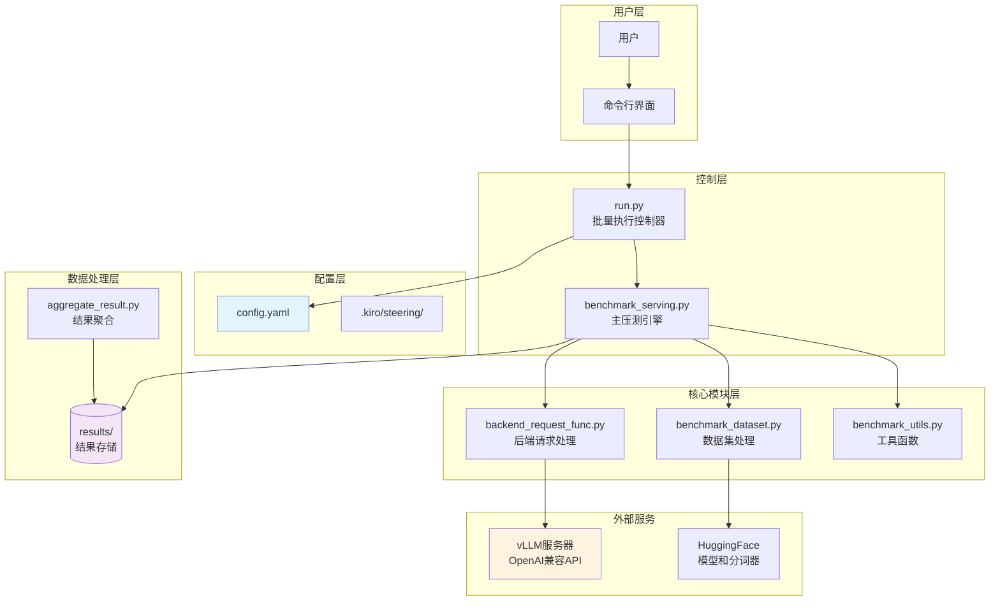

# vLLM推理服务压测工具 - 架构设计

## 系统架构图

## 模块职责说明

### 控制层
- **run.py**: 批量执行控制器，负责读取配置文件，生成参数组合，调度压测任务
- **benchmark_serving.py**: 主压测引擎，实现异步请求调度和性能指标收集

### 核心模块层
- **benchmark_dataset.py**: 数据集处理模块，支持多种数据集格式和数据生成
- **backend_request_func.py**: 后端请求处理模块，实现与各种推理后端的通信
- **benchmark_utils.py**: 工具函数模块，提供通用的辅助功能

### 数据处理层
- **aggregate_result.py**: 结果聚合模块，将多个JSON结果文件合并为CSV报告

## 技术栈

- **异步编程**: asyncio, aiohttp
- **数据处理**: pandas, numpy
- **模型支持**: transformers, vllm
- **配置管理**: yaml
- **进度显示**: tqdm
- **数据集**: datasets (HuggingFace)