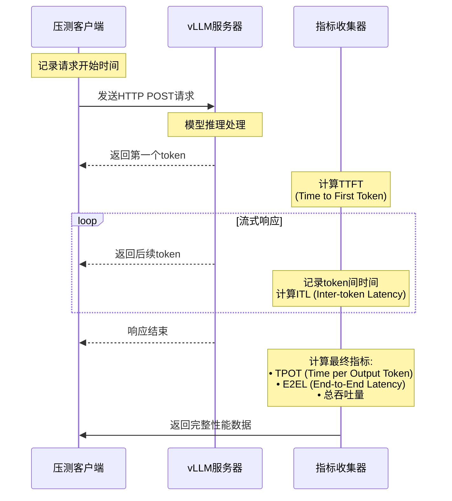
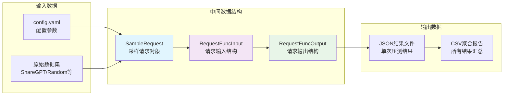

# vLLM推理服务压测工具 - 数据流程图

## 整体数据流程

```mermaid
flowchart TD
    START([开始压测]) --> LOAD_CONFIG[加载config.yaml配置]
    LOAD_CONFIG --> GEN_PARAMS[生成参数组合<br/>输入输出长度 × 并发请求数]
    
    GEN_PARAMS --> LOOP_START{遍历参数组合}
    LOOP_START --> INIT_DATASET[初始化数据集<br/>Random/ShareGPT/Sonnet等]
    
    INIT_DATASET --> LOAD_TOKENIZER[加载分词器<br/>计算token长度]
    LOAD_TOKENIZER --> GEN_REQUESTS[生成测试请求<br/>根据输入输出长度]
    
    GEN_REQUESTS --> ASYNC_DISPATCH[异步请求调度<br/>控制并发数]
    
    subgraph "并发请求处理"
        ASYNC_DISPATCH --> REQ1[请求1]
        ASYNC_DISPATCH --> REQ2[请求2]
        ASYNC_DISPATCH --> REQN[请求N]
        
        REQ1 --> SEND_HTTP1[发送HTTP请求<br/>到vLLM服务器]
        REQ2 --> SEND_HTTP2[发送HTTP请求<br/>到vLLM服务器]
        REQN --> SEND_HTTPN[发送HTTP请求<br/>到vLLM服务器]
        
        SEND_HTTP1 --> STREAM1[处理流式响应<br/>记录时间戳]
        SEND_HTTP2 --> STREAM2[处理流式响应<br/>记录时间戳]
        SEND_HTTPN --> STREAMN[处理流式响应<br/>记录时间戳]
    end
    
    STREAM1 --> COLLECT_METRICS[收集性能指标<br/>TTFT/TPOT/ITL/E2EL]
    STREAM2 --> COLLECT_METRICS
    STREAMN --> COLLECT_METRICS
    
    COLLECT_METRICS --> CALC_STATS[计算统计指标<br/>平均值/中位数/百分位数]
    CALC_STATS --> SAVE_JSON[保存JSON结果文件<br/>bench_io{input}x{output}_mc{concurrency}_np{prompts}.json]
    
    SAVE_JSON --> LOOP_END{是否还有参数组合?}
    LOOP_END -->|是| LOOP_START
    LOOP_END -->|否| AGGREGATE[聚合所有结果<br/>aggregate_result.py]
    
    AGGREGATE --> MERGE_JSON[合并所有JSON文件]
    MERGE_JSON --> GEN_CSV[生成CSV报告<br/>aggregate_results_{date}.csv]
    GEN_CSV --> END([压测完成])
    
    style LOAD_CONFIG fill:#e3f2fd
    style ASYNC_DISPATCH fill:#fff3e0
    style COLLECT_METRICS fill:#e8f5e8
    style SAVE_JSON fill:#fce4ec
```

## 性能指标收集流程



## 数据结构流转



## 关键性能指标定义

| 指标 | 英文全称 | 中文含义 | 计算方法 |
|------|----------|----------|----------|
| TTFT | Time to First Token | 首token时间 | 从请求发送到收到第一个token的时间 |
| TPOT | Time per Output Token | 每token输出时间 | 总输出时间 / 输出token数量 |
| ITL | Inter-token Latency | token间延迟 | 相邻两个token之间的时间间隔 |
| E2EL | End-to-End Latency | 端到端延迟 | 从请求发送到响应完成的总时间 |
| Throughput | Request/Token Throughput | 吞吐量 | 每秒处理的请求数/token数 |